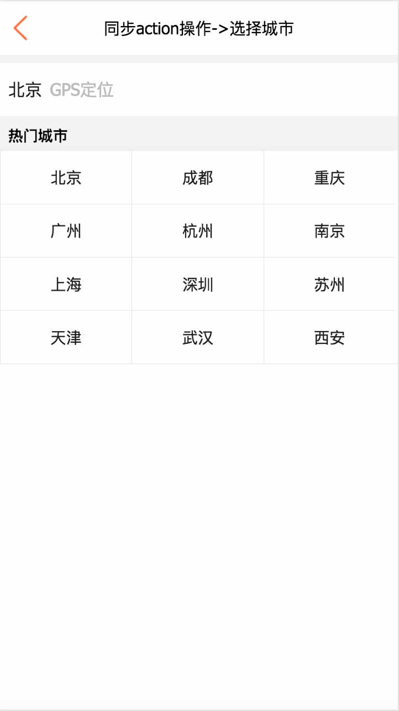

# React技术栈实现XXX电商App-Demo

> 项目地址：https://github.com/Nealyang/React-Fullstack-Dianping-Demo

> 技术栈：react、react-router4.x 、 react-redux 、 webpack3.x、 redux-saga 、 css-module 、 ES6 、babel...

>在慕课网看到相关视频，但是我等屌丝码农真心买不起这个价位的视频。有幸看到源代码，但是看到代码的我。。。也不是很苟同上面代码中react技术栈这一套使用方式。遂自己写了一个demo。

---

一同学习react、node的同学欢迎加入：

Node.js技术交流群：209530601 

React技术栈：398240621

---

### 微信公众号

> 扫码关注微信公众号，获取第一手文章推送

## 项目截图

* 加载

* 首页

* 详情页

* 城市选择

## 项目运行展示(gif)
> 流量党慎入

***项目内容不多，就涉及到三个页面，主要是为了学习新的知识。项目中用的redux-saga也是前天才学习的。项目的架构也是最近在各种探讨研究。还求大神多指点~***

## 项目技术总结

- [x] [react技术栈项目结构探究](./docs/react技术栈项目结构探究.md)
- [x] [redux-saga初体验](./docs/redux-saga初体验.md)
- [x] [关于项目中webpack的配置说明](./docs/关于项目中的webpack使用.md)

## 项目简单说明

* 开发react-redux这一套，我个人的理解是 ***Redux体现的是代码分层、职责分离的编程思想,逻辑与视图严格区分。*** 而某网上的这一套代码，逻辑都写到了view组件层，组件需要关心如何获取数据，如何处理数据，这样的组件层是不容易复用的，Redux的使用也是残缺的。甚至这种情况，你不用Redux，直接定义一个全局的state变量，所有组件都来直接操作它好了。

* 项目还有许多需要完善的地方，redux-saga的使用方式、项目结构、包括webpack3.x配合react的代码优化以及react的Universal渲染甚至后端Node的代码编写。欢迎各路大神前来指教~

## 项目实现

- [x] react热更新 
- [x] css-module使用 
- [x] react-redux异步处理 
- [x] react-router 浏览器传参、获取 
- [x] redux-saga辅助
- [x] 上拉加载更多
- [x] 全局监控Loading
- [x] ......

- [ ] Universal渲染 [可参考我另一个项目webpack1.x](https://github.com/Nealyang/neal-teach-website/blob/master/record/framework.md)

## 安装步骤
    
    # clone this demo 
    git clone ...
    
    # install dependencies
    npm i (or yarn)
    
    # serve with hot reload at localhost:8000
    npm start

## more

后续会继续改进技术，如果有时间会写一个[全栈的demo](https://github.com/Nealyang/React-Express-Blog-Demo)，着重后端Node和mongo的使用。前端依旧使用react技术栈完成。

 (^_^)/~~ 
