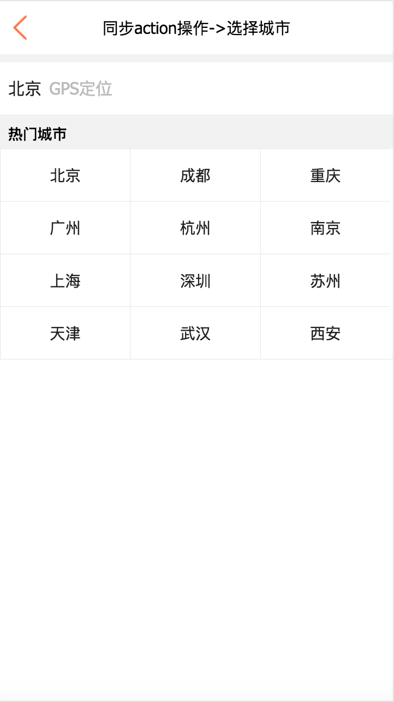

# React技术栈编写XXX电商App-Demo
> 技术栈：react、react-router4.x 、 react-redux 、 webpack3.x、 redux-saga

>在慕课网看到相关视频，但是我等屌丝码农真心买不起这个价位的视频。有幸看到源代码，但是看到代码的我。。。也不是很苟同上面代码中react技术栈这一套使用方式。遂自己写了一个demo。

---

一同学习react、node的同学欢迎加入：

Node.js技术交流群：209530601 

React技术栈：398240621

---

## 项目截图

* 首页

* 详情页

* 城市选择

## 项目运行展示(gif)
> 流量党慎入

[app运行展示](https://github.com/Nealyang/React-Fullstack-Dianping-Demo/blob/master/record/play.gif)

[state树变化](https://github.com/Nealyang/React-Fullstack-Dianping-Demo/blob/master/record/state_tree.gif)

***项目内容不多，就涉及到三个页面，主要是为了学习新的知识。项目中用的redux-saga也是前天才学习的。项目的架构也是最近在各种探讨研究。还求大神多指点~***

## 项目技术总结

- [ ] [react技术栈项目结构探究](./docs/react技术栈项目结构探究.md)
- [ ] [redux-saga初体验](./docs/redux-saga初体验.md)
- [ ] [关于项目中webpack的配置说明](./docs/关于项目中的webpack使用.md)

## 项目简单说明

* 开发react-redux这一套，我个人的理解是 ***Redux体现的是代码分层、职责分离的编程思想,逻辑与视图严格区分。*** 而某网上的这一套代码，逻辑都写到了view组件层，组件需要关心如何获取数据，如何处理数据，这样的组件层是不容易复用的，Redux的使用也是残缺的。甚至这种情况，你不用Redux，直接定义一个全局的state变量，所有组件都来直接操作它好了。

* 项目还有许多需要完善的地方，redux-saga的使用方式、项目结构、包括webpack3.x配合react的代码优化以及react的Universal渲染甚至后端Node的代码编写。欢迎各路大神前来指教~

