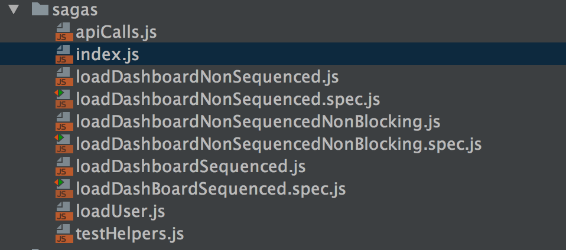

# React技术栈实现大众点评Demo-初次使用redux-saga

>[项目地址](https://github.com/Nealyang/React-Fullstack-Dianping-Demo)

## 项目截图

## redux-saga介绍
众所周知，react仅仅是作用在View层的前端框架，redux作为前端的“数据库”，完美！但是依旧残留着前端一直以来的诟病=>异步。

所以就少不了有很多的中间件（middleware）来处理这些数据，而redux-saga就是其中之一。

不要把redux-saga（下面统称为saga）想的多么牛逼，其实他就是一个***辅助函数***，但是荣耀里辅助拿MVP也不少哈~。

Saga最大的特点就是它可以让你用同步的方式写异步的代码！想象下，如果它能够用来监听你的异步action，然后又用同步的方式去处理。那么，你的react-redux是不是就轻松了很多！

官方介绍，请移步[redux-saga](https://github.com/redux-saga/redux-saga)

saga相当于在redux原有的数据流中多了一层监控，捕获监听到的action，进行处理后，put一个新的action给相应的reducer去处理。

## 基本用法
1、 使用createSagaMiddleware方法创建saga 的Middleware，然后在创建的redux的store时，使用applyMiddleware函数将创建的saga Middleware实例绑定到store上，最后可以调用saga Middleware的run函数来执行某个或者某些Middleware。
2、 在saga的Middleware中，可以使用takeEvery或者takeLatest等API来监听某个action，当某个action触发后，saga可以使用call、fetch等api发起异步操作，操作完成后使用put函数触发action，同步更新state，从而完成整个State的更新。

## saga的优点

>下面介绍saga的API，boring~~~所以先来点动力吧

* 流程拆分更细，应用的逻辑和view更加的清晰，分工明确。异步的action和复杂逻辑的action都可以放到saga中去处理。模块更加的干净
* 因为使用了 Generator，redux-saga让你可以用同步的方式写异步代码
* 能容易地测试 Generator 里所有的业务逻辑
* 可以通过监听Action 来进行前端的打点日志记录，减少侵入式打点对代码的侵入程度
* 。。。

## 走马观花API(安装啥的步骤直接略过)

### takeEvery
用来监听action，每个action都触发一次，如果其对应是异步操作的话，每次都发起异步请求，而不论上次的请求是否返回

    import { takeEvery } from 'redux-saga/effects'
     
    function* watchFetchData() {
      yield takeEvery('FETCH_REQUESTED', fetchData)
    }
### takeLatest
作用同takeEvery一样，唯一的区别是它只关注最后，也就是最近一次发起的异步请求，如果上次请求还未返回，则会被取消。

    function* watchFetchData() {
      yield takeLatest('FETCH_REQUESTED', fetchData)
    }

### redux Effects
在saga的世界里，***所有的任务都通用 yield Effect 来完成***，Effect暂时就理解为一个任务单元吧，其实就是一个JavaScript的对象，可以通过sagaMiddleWare进行执行。

重点说明下，在redux-saga的应用中，所有的Effect都必须被yield后才可以被执行。

    import {fork,call} from 'redux-saga/effects'
    
    import {getAdDataFlow,getULikeDataFlow} from './components/home/homeSaga'
    import {getLocatioFlow} from './components/wrap/wrapSaga'
    import {getDetailFolw} from './components/detail/detailSaga'
    import {getCitiesFlow} from './components/city/citySaga'
    
    export default function* rootSaga () {
        yield fork(getLocatioFlow);
        yield fork(getAdDataFlow);
        yield fork(getULikeDataFlow);
        yield fork(getDetailFolw);
        yield fork(getCitiesFlow);
    }
### call
call用来调用异步函数，将异步函数和函数参数作为call函数的参数传入，返回一个js对象。saga引入他的主要作用是方便测试，同时也能让我们的代码更加规范化。

同js原生的call一样，call函数也可以指定this对象，只要把this对象当第一个参数传入call方法就好了

saga同样提供apply函数，作用同call一样，参数形式同js原生apply方法。 

    export function* getAdData(url) {
        yield put({type:wrapActionTypes.START_FETCH});
        yield  delay(delayTime);//故意的
        try {
            return yield call(get,url);
        } catch (error) {
            yield put({type:wrapActionTypes.FETCH_ERROR})
        }finally {
            yield put({type:wrapActionTypes.FETCH_END})
        }
    }
    
    export function* getAdDataFlow() {
        while (true){
            let request = yield take(homeActionTypes.GET_AD);
            let response = yield call(getAdData,request.url);
            yield put({type:homeActionTypes.GET_AD_RESULT_DATA,data:response.data})
        }
    }

### take
等待 reactjs dispatch 一个匹配的action。take的表现同takeEvery一样，都是监听某个action，但与takeEvery不同的是，他不是每次action触发的时候都相应，而只是在执行顺序执行到take语句时才会相应action。

当在genetator中使用take语句等待action时，generator被阻塞，等待action被分发，然后继续往下执行。

takeEvery只是监听每个action，然后执行处理函数。对于何时响应action和 如何响应action，takeEvery并没有控制权。

而take则不一样，我们可以在generator函数中决定何时响应一个action，以及一个action被触发后做什么操作。

最大区别：take只有在执行流达到时才会响应对应的action，而takeEvery则一经注册，都会响应action。

    export function* getAdDataFlow() {
        while (true){
            let request = yield take(homeActionTypes.GET_AD);
            let response = yield call(getAdData,request.url);
            yield put({type:homeActionTypes.GET_AD_RESULT_DATA,data:response.data})
        }
    }
    
### put
触发某一个action，类似于react中的dispatch

实例如上

### select

作用和 redux thunk 中的 getState 相同。通常会与reselect库配合使用

### fork
非阻塞任务调用机制：上面我们介绍过call可以用来发起异步操作，但是相对于generator函数来说，call操作是阻塞的，只有等promise回来后才能继续执行，而fork是非阻塞的 ，当调用fork启动一个任务时，该任务在后台继续执行，从而使得我们的执行流能继续往下执行而不必一定要等待返回。

### cancel
cancel的作用是用来取消一个还未返回的fork任务。防止fork的任务等待时间太长或者其他逻辑错误。

### all
all提供了一种并行执行异步请求的方式。之前介绍过执行异步请求的api中，大都是阻塞执行，只有当一个call操作放回后，才能执行下一个call操作， call提供了一种类似Promise中的all操作，可以将多个异步操作作为参数参入all函数中，
如果有一个call操作失败或者所有call操作都成功返回，则本次all操作执行完毕。

    import { all, call } from 'redux-saga/effects'
     
    // correct, effects will get executed in parallel
    const [users, repos]  = yield all([
      call(fetch, '/users'),
      call(fetch, '/repos')
    ])
    
###  race
有时候当我们并行的发起多个异步操作时，我们并不一定需要等待所有操作完成，而只需要有一个操作完成就可以继续执行流。这就是race的用处。
他可以并行的启动多个异步请求，只要有一个 请求返回（resolved或者reject），race操作接受正常返回的请求，并且将剩余的请求取消。

    import { race, take, put } from 'redux-saga/effects'
     
    function* backgroundTask() {
      while (true) { ... }
    }
     
    function* watchStartBackgroundTask() {
      while (true) {
        yield take('START_BACKGROUND_TASK')
        yield race({
          task: call(backgroundTask),
          cancel: take('CANCEL_TASK')
        })
      }
    }
    
### actionChannel　　
在之前的操作中，所有的action分发是顺序的，但是对action的响应是由异步任务来完成，也即是说对action的处理是无序的。

如果需要对action的有序处理的话，可以使用actionChannel函数来创建一个action的缓存队列，但一个action的任务流程处理完成后，才可是执行下一个任务流。

    import { take, actionChannel, call, ... } from 'redux-saga/effects'
     
    function* watchRequests() {
      // 1- Create a channel for request actions
      const requestChan = yield actionChannel('REQUEST')
      while (true) {
        // 2- take from the channel
        const {payload} = yield take(requestChan)
        // 3- Note that we're using a blocking call
        yield call(handleRequest, payload)
      }
    }
     
    function* handleRequest(payload) { ... }
 
>从我写的这个项目可以看到，其实我很多API都是没有用到，常用的基本也就这么些了

## 从代码中去记忆API
这里我放两个实际项目中代码实例，大家可以看看熟悉下上面说到的API

rootSaga.js

    // This file contains the sagas used for async actions in our app. It's divided into
    // "effects" that the sagas call (`authorize` and `logout`) and the actual sagas themselves,
    // which listen for actions.
    
    // Sagas help us gather all our side effects (network requests in this case) in one place
    
    import {hashSync} from 'bcryptjs'
    import genSalt from '../auth/salt'
    import {browserHistory} from 'react-router'
    import {take, call, put, fork, race} from 'redux-saga/effects'
    import auth from '../auth'
    
    import {
      SENDING_REQUEST,
      LOGIN_REQUEST,
      REGISTER_REQUEST,
      SET_AUTH,
      LOGOUT,
      CHANGE_FORM,
      REQUEST_ERROR
    } from '../actions/constants'
    
    /**
     * Effect to handle authorization
     * @param  {string} username               The username of the user
     * @param  {string} password               The password of the user
     * @param  {object} options                Options
     * @param  {boolean} options.isRegistering Is this a register request?
     */
    export function * authorize ({username, password, isRegistering}) {
      // We send an action that tells Redux we're sending a request
      yield put({type: SENDING_REQUEST, sending: true})
    
      // We then try to register or log in the user, depending on the request
      try {
        let salt = genSalt(username)
        let hash = hashSync(password, salt)
        let response
    
        // For either log in or registering, we call the proper function in the `auth`
        // module, which is asynchronous. Because we're using generators, we can work
        // as if it's synchronous because we pause execution until the call is done
        // with `yield`!
        if (isRegistering) {
          response = yield call(auth.register, username, hash)
        } else {
          response = yield call(auth.login, username, hash)
        }
    
        return response
      } catch (error) {
        console.log('hi')
        // If we get an error we send Redux the appropiate action and return
        yield put({type: REQUEST_ERROR, error: error.message})
    
        return false
      } finally {
        // When done, we tell Redux we're not in the middle of a request any more
        yield put({type: SENDING_REQUEST, sending: false})
      }
    }
    
    /**
     * Effect to handle logging out
     */
    export function * logout () {
      // We tell Redux we're in the middle of a request
      yield put({type: SENDING_REQUEST, sending: true})
    
      // Similar to above, we try to log out by calling the `logout` function in the
      // `auth` module. If we get an error, we send an appropiate action. If we don't,
      // we return the response.
      try {
        let response = yield call(auth.logout)
        yield put({type: SENDING_REQUEST, sending: false})
    
        return response
      } catch (error) {
        yield put({type: REQUEST_ERROR, error: error.message})
      }
    }
    
    /**
     * Log in saga
     */
    export function * loginFlow () {
      // Because sagas are generators, doing `while (true)` doesn't block our program
      // Basically here we say "this saga is always listening for actions"
      while (true) {
        // And we're listening for `LOGIN_REQUEST` actions and destructuring its payload
        let request = yield take(LOGIN_REQUEST)
        let {username, password} = request.data
    
        // A `LOGOUT` action may happen while the `authorize` effect is going on, which may
        // lead to a race condition. This is unlikely, but just in case, we call `race` which
        // returns the "winner", i.e. the one that finished first
        let winner = yield race({
          auth: call(authorize, {username, password, isRegistering: false}),
          logout: take(LOGOUT)
        })
    
        // If `authorize` was the winner...
        if (winner.auth) {
          // ...we send Redux appropiate actions
          yield put({type: SET_AUTH, newAuthState: true}) // User is logged in (authorized)
          yield put({type: CHANGE_FORM, newFormState: {username: '', password: ''}}) // Clear form
          forwardTo('/dashboard') // Go to dashboard page
        }
      }
    }
    
    /**
     * Log out saga
     * This is basically the same as the `if (winner.logout)` of above, just written
     * as a saga that is always listening to `LOGOUT` actions
     */
    export function * logoutFlow () {
      while (true) {
        yield take(LOGOUT)
        yield put({type: SET_AUTH, newAuthState: false})
    
        yield call(logout)
        forwardTo('/')
      }
    }
    
    /**
     * Register saga
     * Very similar to log in saga!
     */
    export function * registerFlow () {
      while (true) {
        // We always listen to `REGISTER_REQUEST` actions
        let request = yield take(REGISTER_REQUEST)
        let {username, password} = request.data
    
        // We call the `authorize` task with the data, telling it that we are registering a user
        // This returns `true` if the registering was successful, `false` if not
        let wasSuccessful = yield call(authorize, {username, password, isRegistering: true})
    
        // If we could register a user, we send the appropiate actions
        if (wasSuccessful) {
          yield put({type: SET_AUTH, newAuthState: true}) // User is logged in (authorized) after being registered
          yield put({type: CHANGE_FORM, newFormState: {username: '', password: ''}}) // Clear form
          forwardTo('/dashboard') // Go to dashboard page
        }
      }
    }
    
    // The root saga is what we actually send to Redux's middleware. In here we fork
    // each saga so that they are all "active" and listening.
    // Sagas are fired once at the start of an app and can be thought of as processes running
    // in the background, watching actions dispatched to the store.
    export default function * root () {
      yield fork(loginFlow)
      yield fork(logoutFlow)
      yield fork(registerFlow)
    }
    
    // Little helper function to abstract going to different pages
    function forwardTo (location) {
      browserHistory.push(location)
    }

另一个demo  saga也跟我一样，拆分了下

简单看两个demo就好

index.js

    import { takeLatest } from 'redux-saga';
    import { fork } from 'redux-saga/effects';
    import {loadUser} from './loadUser';
    import {loadDashboardSequenced} from './loadDashboardSequenced';
    import {loadDashboardNonSequenced} from './loadDashboardNonSequenced';
    import {loadDashboardNonSequencedNonBlocking, isolatedForecast, isolatedFlight } from './loadDashboardNonSequencedNonBlocking';
    
    function* rootSaga() {
      /*The saga is waiting for a action called LOAD_DASHBOARD to be activated */
      yield [
        fork(loadUser),
        takeLatest('LOAD_DASHBOARD', loadDashboardSequenced),
        takeLatest('LOAD_DASHBOARD_NON_SEQUENCED', loadDashboardNonSequenced),
        takeLatest('LOAD_DASHBOARD_NON_SEQUENCED_NON_BLOCKING', loadDashboardNonSequencedNonBlocking),
        fork(isolatedForecast),
        fork(isolatedFlight)
      ];
    }
    
    export default rootSaga;

loadDashboardNonSequencedNonBlocking.js

    import { call, put, select , take} from 'redux-saga/effects';
    import {loadDeparture, loadFlight, loadForecast } from './apiCalls';
    
    export const getUserFromState = (state) => state.user;
    
    export function* loadDashboardNonSequencedNonBlocking() {
      try {
        //Wait for the user to be loaded
        yield take('FETCH_USER_SUCCESS');
    
        //Take the user info from the store
        const user = yield select(getUserFromState);
    
        //Get Departure information
        const departure = yield call(loadDeparture, user);
    
        //Update the UI
        yield put({type: 'FETCH_DASHBOARD3_SUCCESS', payload: {departure}});
    
        //trigger actions for Forecast and Flight to start...
        //We can pass and object into the put statement
        yield put({type: 'FETCH_DEPARTURE3_SUCCESS', departure});
    
      } catch(error) {
        yield put({type: 'FETCH_FAILED', error: error.message});
      }
    }
    
    export function* isolatedFlight() {
      try {
        /* departure will take the value of the object passed by the put*/
        const departure = yield take('FETCH_DEPARTURE3_SUCCESS');
    
        //Flight can be called unsequenced /* BUT NON BLOCKING VS FORECAST*/
        const flight = yield call(loadFlight, departure.flightID);
        //Tell the store we are ready to be displayed
        yield put({type: 'FETCH_DASHBOARD3_SUCCESS', payload: {flight}});
    
      } catch (error) {
        yield put({type: 'FETCH_FAILED', error: error.message});
      }
    }
    
    export function* isolatedForecast() {
        try {
          /* departure will take the value of the object passed by the put*/
          const departure = yield take('FETCH_DEPARTURE3_SUCCESS');
    
          const forecast = yield call(loadForecast, departure.date);
          yield put({type: 'FETCH_DASHBOARD3_SUCCESS', payload: { forecast }});
    
        } catch(error) {
          yield put({type: 'FETCH_FAILED', error: error.message});
        }
    }

## 交流

Node.js技术交流群：209530601 

React技术栈：398240621